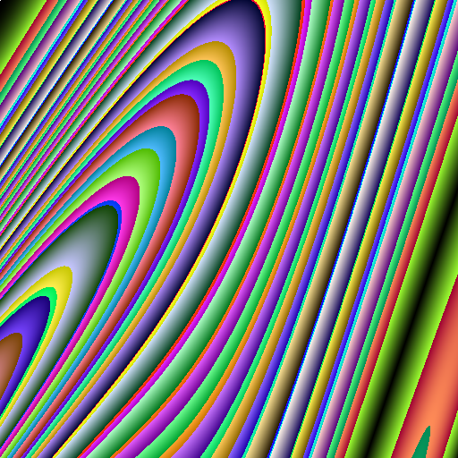
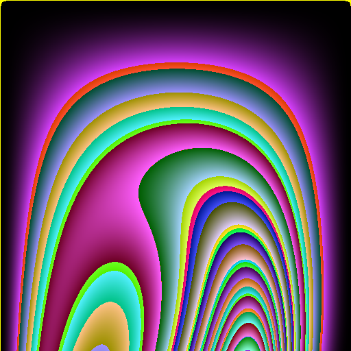
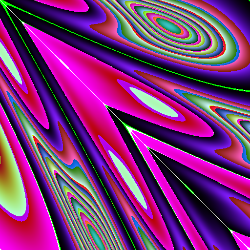
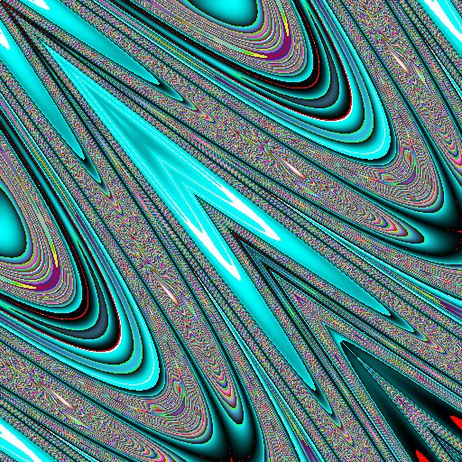

# ArtBot

[](https://travis-ci.com/gabrielbarker/ArtBot)

A CLI tool to generate random, pretty png's. ArtBot is capable of producing images in any resolution. Different methods of producing images can be substituted for one another.

ArtBot can be built out of the box using make:

```
make clean
make
```

ArtBot can be run from the build folder:

```
./artbot
```

This will run ArtBot with a random seed, creating a png whose name is based on the seed. The default width is 256 pixels.

These details can be changed using command arguments.

| Key |                       Effect                       |
| :-: | :------------------------------------------------: |
| -n  |            Supply the name for the png             |
| -s  |  Supply the seed for the random number generation  |
| -w  | Supply the width and height in pixels of the image |

Here's an example command that would create a png called `test.png` with the random seed `1591005661` with resolution `4096`:

```
./artbot -n test -s 1591005661 -w 4096
```

|  |  |
| :----------------------------------: | :----------------------------------: |
|  |  |

In the future, ArtBot will have multiple different methods of generating images. The structure will permit 'plugging in' different generators, supplied as a command line argument. Also the solution will seek to avoid less interesting images that are produced, by restricting the random aspets of the generation.

Any suggestions are welcome, as are any contributions.


